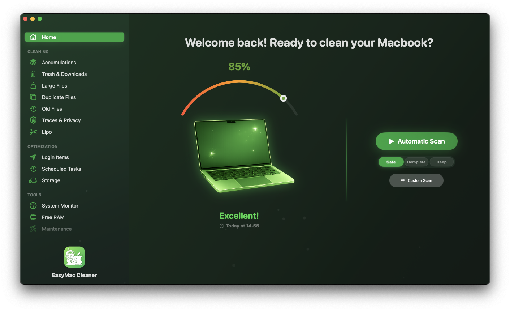
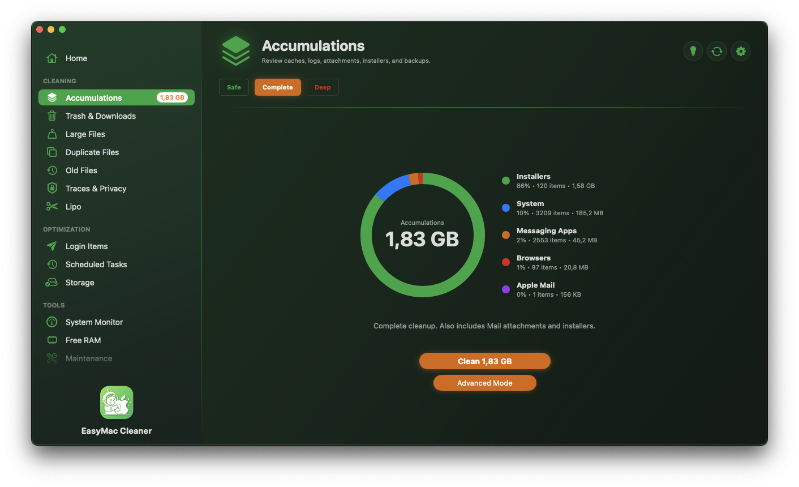
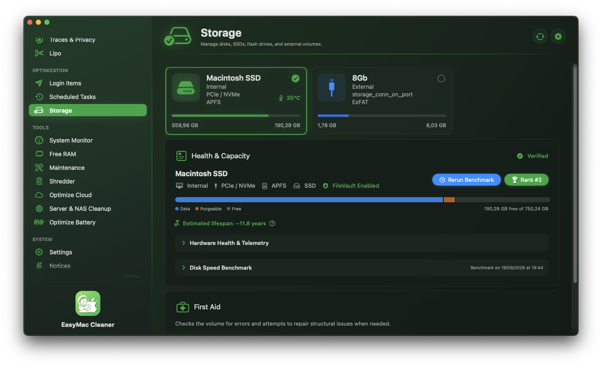
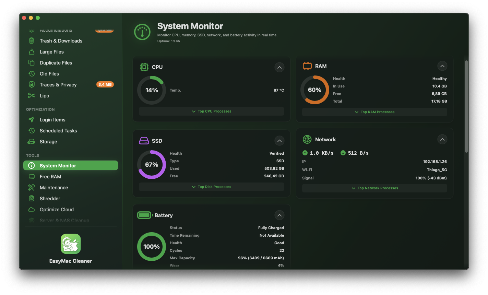
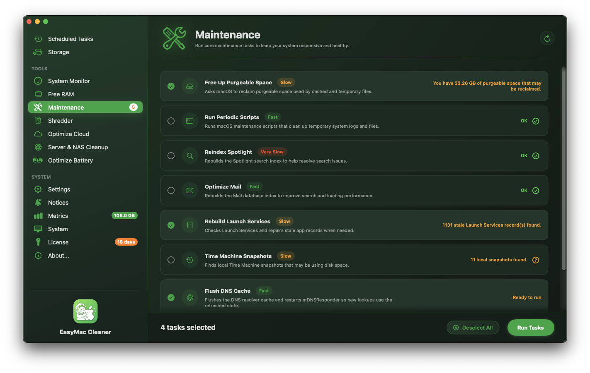
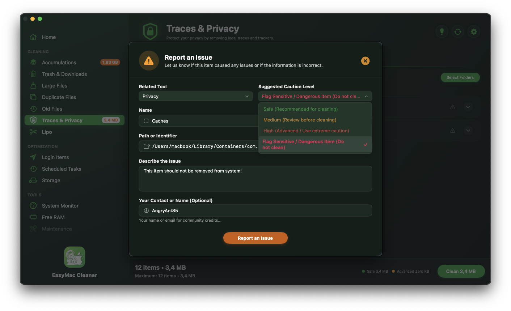
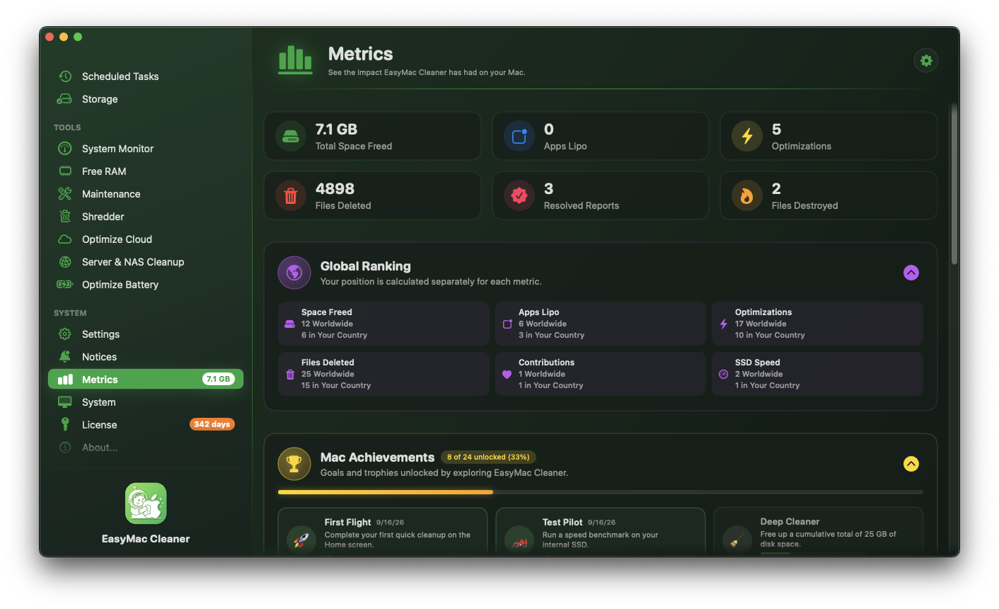

<div align="center">

# 🧹 EasyMac Cleaner

### A simple, native cleaner and optimizer for macOS

[](https://formulae.brew.sh/cask/easymac-cleaner)
[](https://martiancat.space)
[](https://martiancat.space)
[](https://swift.org)
[](https://developer.apple.com/xcode/swiftui/)
[](https://github.com/MartianCatBR/easymac-cleaner#-supported-languages)
<br/>
[](https://martiancat.space)
[](https://martiancat.space)
[](https://martiancat.space/privacy.html)
[](https://martiancat.space)
[](https://updates.martiancat.space/cleaner/EasyMacCleaner-1.3.zip)

<br/>



<br/><br/>

[**🌐 Official website**](https://martiancat.space) &nbsp;•&nbsp; 
[**⬇️ Download latest**](https://updates.martiancat.space/cleaner/EasyMacCleaner-1.3.zip) &nbsp;•&nbsp; 
[**📜 Privacy policy**](https://martiancat.space/privacy.html) &nbsp;•&nbsp; 
[**💬 Report an issue**](https://github.com/MartianCatBR/easymac-cleaner/issues)

</div>

---

## ⚡ Quick install via Homebrew

The easiest way to install and keep it updated:

```bash
brew install --cask easymac-cleaner
```

> 💡 **Tip**: later you can just run `brew upgrade --cask easymac-cleaner` or use the built-in Sparkle updater.

### 📦 Direct download
Prefer the zip? Grab the signed and notarized build from the [Official website](https://martiancat.space) or from the [Releases](https://github.com/MartianCatBR/easymac-cleaner/releases) page.

---

## ✨ What it does

Three main parts: cleaning junk, light optimization, and a few extra tools.

### 🧹 1. Cleanup
- **Accumulations**: Clears orphaned caches, temp files, crash logs, and Xcode derived data. Usually frees up a good amount of space.
- **Trash & Downloads**: Removes old trash items and leftover installers with simple age rules.
- **Large Files**: Fast finder for the biggest space hogs so you can decide what to keep or delete.
- **Duplicate Files**: Finds exact duplicates by content hash, shows a side-by-side preview, then lets you remove them safely.
- **Old Files**: Surfaces documents and archives you haven’t touched in months or years.
- **Traces & Privacy**: Wipes browsing history, cookies, download lists and caches from Safari, Chrome, Brave, Edge, Firefox and other browsers.
- **Lipo**: Strips the unused architecture from universal binaries (e.g. removes the Intel slice on Apple Silicon Macs). Keeps a backup just in case.

### 🚀 2. Optimization
- **Login Items**: Turn off startup apps and background helpers that slow down boot.
- **Scheduled Tasks**: View and manage third-party LaunchDaemons and LaunchAgents.
- **Storage**: Simple visualizer that shows volume health and recovers purgeable space.

### 🛠️ 3. Tools
- **System Monitor**: Lightweight menu-bar display for live CPU, memory pressure, disk activity and temperature.
- **Free RAM**: Releases inactive memory and flushes caches with safe native calls.
- **Maintenance**: Rebuilds Spotlight, flushes DNS, repairs permissions and runs the usual system scripts.
- **Shredder**: Secure multi-pass deletion so files can’t be recovered later.
- **Optimize Cloud**: Clears local offline caches from iCloud Drive, OneDrive, Google Drive and Dropbox without touching the cloud copies.
- **Server & NAS Cleanup**: Removes .DS_Store, AppleDouble and other network junk from SMB, NFS and AFP shares.
- **Optimize Battery**: Basic energy info, power tweaks and longevity tips for MacBooks.

---

## 🌐 Community crowdsourcing

Anyone can suggest new leftover patterns or cache locations from inside the app. After a quick check, the new rules go out to everyone through the MartianCat API — no need to wait for a full app update.
When a suggestion of yours gets accepted you get a small badge and it shows up in your Metrics page under resolved contributions.

---

## 🏆 Optional ranking (metrics)

There’s a completely optional ranking system if you feel like competing a bit:

- Global and country leaderboar based on total space recovered.
- Simple achievements for cleanup volume and accepted community suggestions.
- 100 % opt-in and anonymous. It only uses a random install token — no names, no personal data, no file names.

---

## 📸 Screenshots

<div align="center">

| ⚡ Junk cleaning | 📊 Storage health and purgeable space |
| :---: | :---: |
|  |  |

| 🎛️ Real-time system monitor | 🔧 System maintenance and scripts |
| :---: | :---: |
|  |  |

| 🌐 Community crowdsourcing | 🏆 Metrics and global ranking |
| :---: | :---: |
|  |  |

</div>

---

## 🛡️ Security & privacy

- Signed with an Apple Developer ID and notarized.
- Stays inside normal macOS security rules. No need to turn off SIP or install any kernel extensions.
- All file processing is done locally. Your personal files never leave the Mac.
- We collect only basic, 100% anonymous telemetry to improve the app. No data reveals who you are or what you do.
- Full details are in the privacy policy at [**martiancat.space/privacy.html**](https://martiancat.space/privacy.html).

---

## 💻 System requirements

- macOS 11.0 (Big Sur) or later.
- Universal binary — native on both Apple Silicon and Intel

---

## 🌍 Supported languages

Fully localized in **11 languages**:

- 🇺🇸 **English**
- 🇧🇷 **Português** (portuguese)
- 🇪🇸 **Español** (spanish)
- 🇩🇪 **Deutsch** (german)
- 🇮🇹 **Italiano** (italian)
- 🇫🇷 **Français** (french)
- 🇨🇳 **简体中文** (simplified Chinese)
- 🇯🇵 **日本語** (japanese)
- 🇰🇷 **한국어** (korean)
- 🇳🇱 **Nederlands** (dutch)
- 🇵🇱 **Polski** (polish)

---

## 📬 Feedback & support

- Bug reports and suggestions: please open an issue in the [Issues](https://github.com/MartianCatBR/easymac-cleaner/issues) tab.
- Website, licensing, etc: Visit [martiancat.space](https://martiancat.space).

<br/>

<div align="center">
  <sub>Developed with ❤️ by <a href="https://martiancat.space">MartianCat</a>.</sub>
</div>
